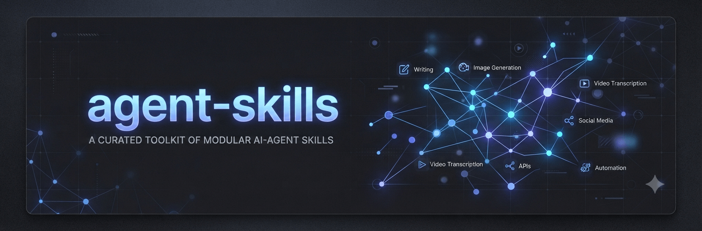

# agent-skills



Personal Pi coding-agent skills.

## Skills

| Skill | Description |
|---|---|
| `buffer` | Manage social media posts using Buffer.com |
| `generate-image` | Generate images from text prompts via Replicate |
| `social-media-images` | Consistent LinkedIn/social carousel images |
| `social-media-post` | Draft social posts from ideas, videos, research |
| `tailored-cv` | Tailor CV PDFs for job descriptions |
| `video-audio-transcription` | Transcribe local video/audio files |
| `youtube-transcript` | Fetch YouTube video transcripts |

## Install

These skills use the [Agent Skills](https://agentskills.io/) format. From the repository root, copy or symlink the skill folders into the directory used by your agent.

### Pi

```bash
ln -sfn "<PATH_TO_REPO>/SKILLS/<SKILL>" ~/.pi/agent/skills/<SKILL>
```

### Claude Code

```bash
ln -sfn "<PATH_TO_REPO>/SKILLS/<SKILL>" ~/.claude/skills/<SKILL>
```

### OpenAI Codex CLI

Use the current personal skills directory:

```bash
ln -sfn "<PATH_TO_REPO>/SKILLS/<SKILL>" ~/.agents/skills/<SKILL>
```

Older Codex versions may also use `~/.codex/skills` (controlled by `CODEX_HOME`).

### OpenCode

```bash
ln -sfn "<PATH_TO_REPO>/SKILLS/<SKILL>" ~/.config/opencode/skills/<SKILL>
```

Replace `<PATH_TO_REPO>` with the local path to this repository and `<SKILL>` with the directory name of the skill you want to install, such as `buffer`, `social-media-post`, or `youtube-transcript`.

### Skills with dependencies

Run these commands from the repository root after installing the corresponding skill:

```bash
cd <SKILL_DIRECTORY>/generate-image && npm install
cd <SKILL_DIRECTORY>/youtube-transcript && npm install
```

### Prerequisites

| Skill | Additional requirements |
|---|---|
| `buffer` | Buffer MCP server configured for your agent and `BUFFER_API_KEY` |
| `generate-image` | Node.js 18+, npm dependencies, and `REPLICATE_API_TOKEN` |
| `orwell-writing` | None |
| `social-media-images` | `generate-image` skill, `REPLICATE_API_TOKEN`, and Google Chrome for HTML templates |
| `social-media-post` | `youtube-transcript` for YouTube sources; `uv` and Python 3.12 for link previews; optional `social-media-images` and Buffer MCP for images and scheduling |
| `video-audio-transcription` | `ffmpeg` for video files; a transcription backend such as macOS Speech, `faster-whisper`, `whisper`, `mlx_whisper`, or whisper.cpp |
| `witan` | The `oracle` subagent configured with fallback models |
| `youtube-transcript` | Node.js and npm dependencies |

#### Environment variables

Set these only when using the corresponding features:

- `BUFFER_API_KEY` — Buffer MCP access.
- `REPLICATE_API_TOKEN` — image generation with `generate-image` or `social-media-images`.
- `VIDEO_TRANSCRIPTION_ALLOW_MODEL_DOWNLOAD=1` — allow automatic model downloads for supported transcription backends.
- `WHISPER_CPP_MODEL` — model path when using a whisper.cpp backend.
